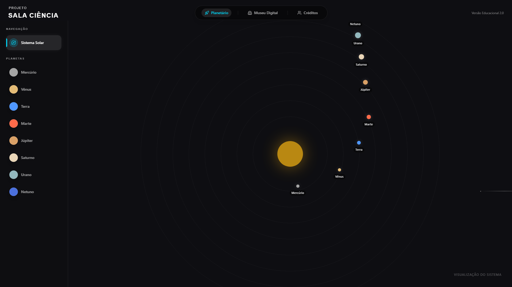
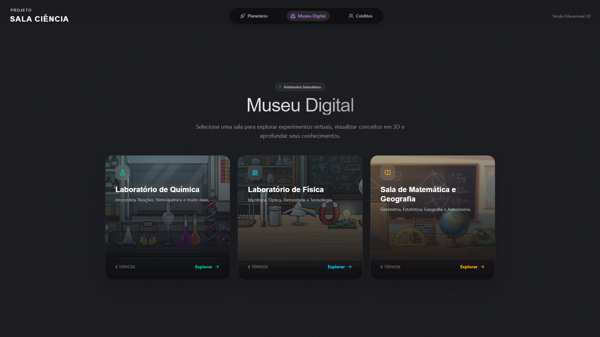
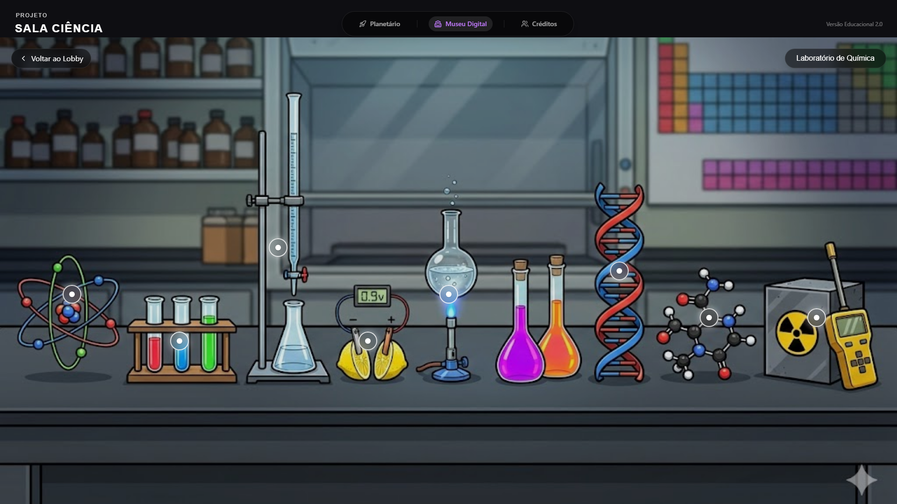
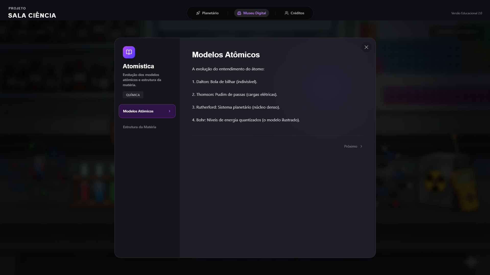
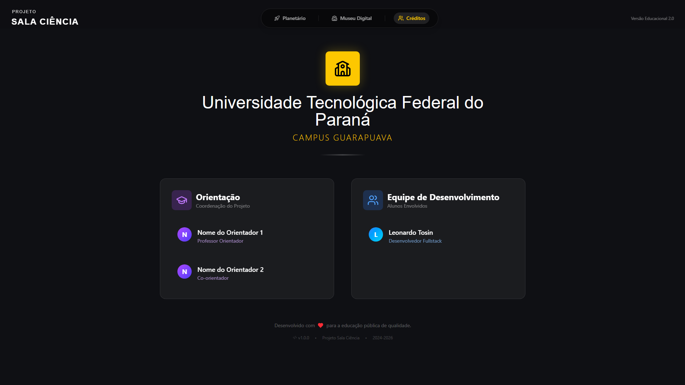
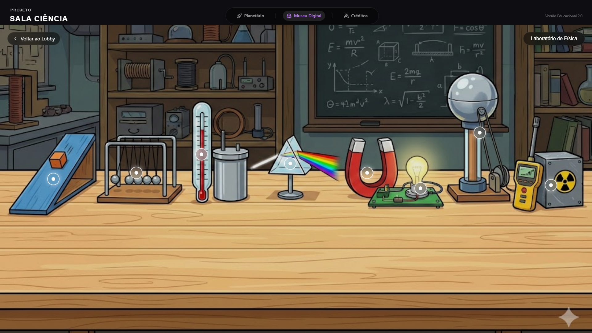
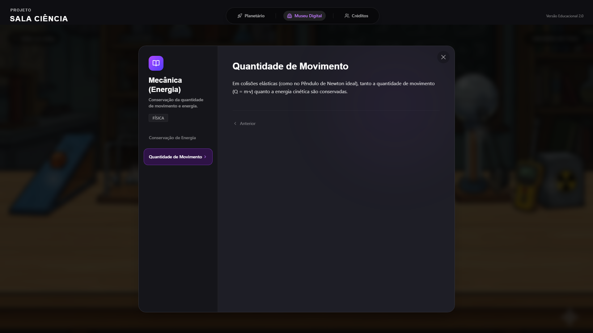

# PROJETO SALA CIÊNCIA - Planetário e Museu Digital

Bem-vindo ao repositório do **Projeto Sala Ciência**, uma aplicação web educativa desenvolvida para o ensino de astronomia e ciências afins para alunos do ensino médio (14-16 anos).

Este projeto foi desenvolvido com foco em interatividade, design visual imersivo e facilidade de manutenção.

## 🚀 Tecnologias Utilizadas

- **React:** Biblioteca principal para construção da interface.
- **Tailwind CSS (v4):** Framework de estilização utilitária.
- **Motion (antigo Framer Motion):** Biblioteca para animações fluidas e interações complexas.
- **Lucide React:** Biblioteca de ícones.
- **Vite:** Build tool (assumido pelo ambiente).

## � Galeria de Telas

### Planetário Interativo

<table>
  <tr>
    <td align="center"><br/><b>Sistema Solar 3D</b><br/>Visualização interativa de todos os planetas do sistema solar</td>
    <td align="center"><br/><b>Detalhes do Planeta</b><br/>Informações científicas detalhadas sobre cada planeta</td>
  </tr>
  <tr>
    <td align="center"><br/><b>Órbitas Planetárias</b><br/>Visualização das trajetórias orbitais ao redor do Sol</td>
    <td align="center"><br/><b>Exploração Interativa</b><br/>Interface para navegação e seleção de planetas</td>
  </tr>
</table>

### Museu Digital

<table>
  <tr>
    <td align="center"><br/><b>Laboratório de Química</b><br/>Sala interativa com hotspots sobre reações químicas, estrutura elementar e eletroquímica</td>
    <td align="center"><br/><b>Laboratório de Física</b><br/>Experimentos e demonstrações de conceitos fundamentais da física</td>
  </tr>
  <tr>
    <td align="center"><br/><b>Sala de Matemática e Geografia</b><br/>Espaço educativo com modelos geométricos, conjuntos de dados e mapas cartográficos</td>
    <td align="center"><br/><b>Navegação do Museu</b><br/>Interface de seleção e acesso às diferentes salas temáticas</td>
  </tr>
</table>

## �📂 Estrutura do Projeto

```
/
├── components/          # Componentes React reutilizáveis
│   ├── figma/           # Componentes específicos de importação do Figma
│   ├── museum/          # Componentes da seção Museu Digital
│   ├── planetarium/     # Componentes da seção Planetário
│   ├── ui/              # Componentes de interface genéricos (botões, cards, etc.)
│   └── CreditsView.tsx  # Tela de Créditos
├── data/                # Dados estáticos da aplicação
│   ├── museum.ts        # Configuração das salas, hotspots e conteúdos do museu
│   └── planets.ts       # Dados dos planetas (físicos, descrições, imagens)
├── imports/             # SVGs e assets importados (não editar manualmente)
├── styles/              # Arquivos CSS globais
└── App.tsx              # Componente principal e roteamento básico
```

## 🛠️ Guia de Manutenção e Extensão

### Adicionar ou Editar Planetas

1.  Abra o arquivo `/data/planets.ts`.
2.  Adicione ou edite um objeto na lista `PLANETS`.
3.  As imagens devem ser importadas no topo do arquivo.
4.  **Importante:** `orbitRadius` define a distância visual do sol, e `orbitSpeed` define o tempo (em segundos) para uma translação completa.

### Adicionar ou Editar Salas do Museu

1.  Abra o arquivo `/data/museum.ts`.
2.  Para criar uma nova sala, adicione um objeto à lista `MUSEUM_ROOMS`.
3.  Para adicionar conteúdo (hotspots), edite o array `hotspots` dentro da sala desejada.
    - `x` e `y` são porcentagens (0-100) relativas ao tamanho da imagem de fundo da sala.
    - O conteúdo suporta HTML básico ou texto puro.

### Estilização

O projeto utiliza Tailwind CSS. Evite criar arquivos CSS separados. Use classes utilitárias diretamente nos componentes. Para animações complexas, consulte a documentação do `motion/react`.

## 🎓 Créditos e Instituição

Este projeto é uma iniciativa vinculada à **UTFPR - Universidade Federal do Paraná**, Campus Guarapuava.
Consulte a aba "Créditos" na aplicação para ver a lista de orientadores e alunos envolvidos.

---
